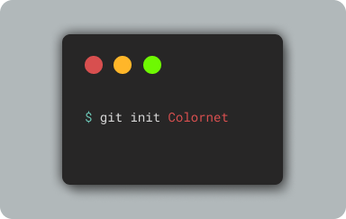

  

# Want to colorize the old black&white huddy-buddy in chuddy images into colored by running this project

## Python 3.8 is recommended

- Open Terminal (for window users use powershell)

      git clone https://github.com/karan-ksrk/Colornet
      cd Colornet\FastApi
      pip install requirements.txt
      python app.py

- Open Another Terminal

      cd aishow
      npm install
      npm start

### Enjoy 😎😎
